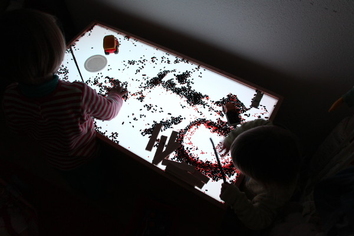

La Table Lumineuse
==================

This repository holds the C++ source code of the light table I've build for my
daughters.



It is meant to run on a Raspberry PI and controls a [LED
strip](http://www.adafruit.com/product/306) as well as speakers.

The whole thing can be controlled from any device (tablet, phone) by connecting
to its web page. It exposes a simple REST API (see
[handler.cpp](src/handler.cpp) for the exact list of support actions), so it
would be easy to integrate it with other applications.


Installation
------------

### Build

On a fresh raspbian (I recommend raspbian lite),

```
$ sudo apt install build-essential cmake git libjsoncpp-dev libboost-system-dev libboost-thread-dev libboost-filesystem-dev
```

For sound support, install as well `libsfml`:
```
$ sudo apt install libsfml-dev
```

Then:

```
$ git clone https://github.com/skadge/table-lumineuse.git
$ cd table-lumineuse && mkdir build && cd build
$ cmake .. -DCMAKE_BUILD_TYPE=Release -DWITH_SOUNDS=ON
$ make
$ sudo make install
```

### Installation/Configuration

First, enable the SPI port in `raspi-config` (available in `Advanced options` or `Interfacing` in more recent version of ` raspi-config`).

TBD: $LANG=C ; $LC_ALL=C; $LD_LIBRARY_PATH=/usr/local/lib

Then you need a webserver to serve the HTML interface:

```
$ sudo apt install nginx
```

Then:

```
$ sudo ln -s `pwd`/html /var/www/table
```

And replace the default site definition `/etc/nginx/sites-enabled/default` with the following content:

```
server {
    listen 80;

    location / {
        root /var/www/table;
        try_files $uri $uri/ /index.html;
        expires 30d;
    }
}
```

Restart `nginx`:

```
sudo systemctl restart nginx
```

### Start-up the table whenever the raspberrypi boots

```
$ cd config && sudo ln -s table /etc/init.d/table
$ sudo systemctl enable table
```


### Marker tracking

For markers tracking, `table-lumineuse` uses the raspberrypi camera. You must
install OpenCV:

```
$ sudo apt install libopencv-dev`
```

And then, the [https://sourceforge.net/projects/raspicam](raspicam library).

Finally, reconfigure the project with the option `WITH_SPOT_TRACKING=ON` and recompile:

```
$ cd build
$ cmake .. _DCMAKE_BUILD_TYPE=Release -DWITH_SOUNDS=ON -DWITH_SPOT_TRACKING=ON
$ make
$ sudo make install
```

